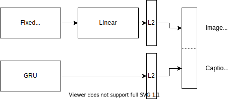

### Shared-representation model



This model tries to enforce similarity between the image and caption representations. The similarity score is defined as 

```
S(i,c) = - |f_i(i) - f_c(c))|^2
```

where `f_i` and `f_c` are embedding functions for images and captions respectively.

We use a GRU for language modelling with GloVe vectors as embedding and a pretrained CNN to generate static image features. Currently the CNN is a Resnet50.

As loss function, the contrastive loss a.k.a pairwise ranking loss is used.
The contrastive loss enforces correct instances to have a penalty of zero and incorrect instances to reach a certain penalty margin.

### Training

Before training the model, setup the flickr dataset with `flickr_split.py` and
convert the GloVe embeddings using `glove_conv.py`.

Then, you can train via

```
python3 main.py --train
```

### Evaluation

You can generate a random sample using `subset.py`.
Run the `main.py` script without the training flag.
The recall will be computed for image to caption and vice versa.

### Hyperparameters:

* Margin
* Batch size
* GloVe vector size
* Shared space embedding size
* Adam learning rate
